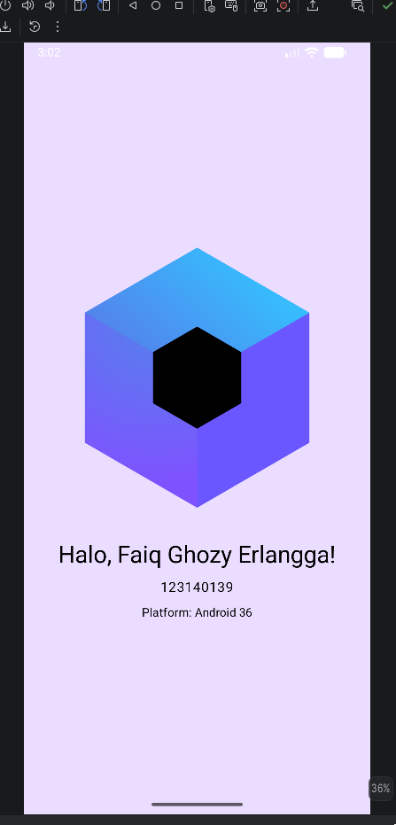

# Aplikasi Hello World Compose Multiplatform
Aplikasi ini dibuat untuk saya mempelajari basic setup dan project structure dari Compose Multiplatform.
- Nama : Faiq Ghozy Erlangga
- NIM  : 123140139

## Screenshot Aplikasi

### Cara run aplikasi
- Buka Android Studio
- Buka file "/Pertemuan-1/shared/src/commonMain/kotlin/com/pertemuan1/App.kt"
- Tekan tombol hijau Run di kanan atas
- Buka aplikasi Pertemuan-1
