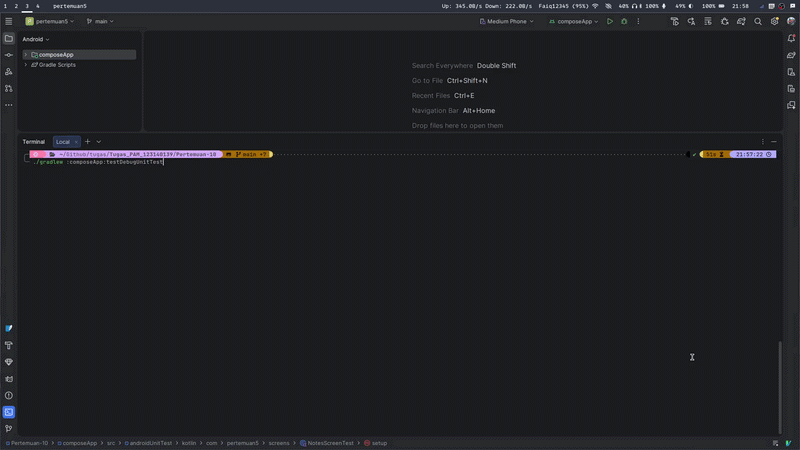
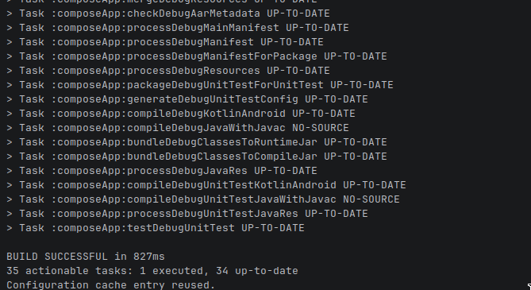

# Testing Aplikasi Notes - Pertemuan 10

## Demo

## Screenshot Aplikasi

## Cara run aplikasi
- Buka Android Studio
- Buka folder `Pertemuan-8`
- Tekan tombol **Run** (Ikon palu atau play hijau)

## Test Cases

### NoteRepository (Unit Test)
- Menyimpan dan mengambil semua catatan
- Mengambil catatan terurut berdasarkan judul
- Mencari catatan berdasarkan kata kunci
- Memperbarui isi catatan
- Menghapus catatan

### NotesViewModel (Flow dan Logic Test)
- Memastikan state awal adalah Loading
- Memastikan state berubah ke Success saat ada data
- Memastikan state berubah ke Empty saat data kosong
- Memastikan pencarian memicu fungsi repository
- Memastikan penambahan catatan memicu fungsi repository

### NotesScreen (UI Test)
- Menampilkan indikator loading pada state Loading
- Menampilkan pesan kosong pada state Empty
- Menampilkan daftar catatan pada state Success

## Cara menjalankan test
- Jalankan perintah `./gradlew :composeApp:testDebugUnitTest` di terminal
