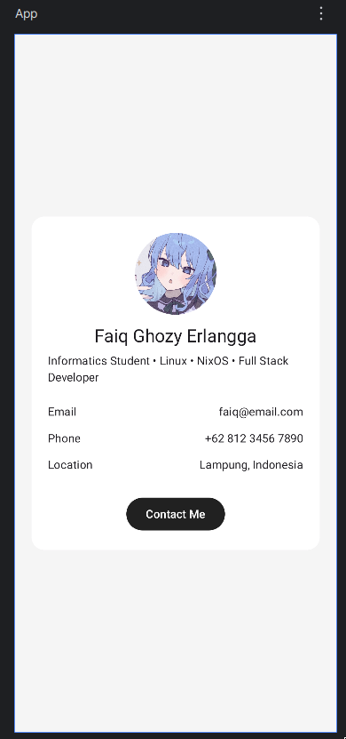

# Aplikasi Profile Sederhana
## Screenshot Aplikasi

### Cara run aplikasi
- Buka Android Studio
- Buka file "/pertemuan-2/composeApp/src/commonMain/kotlin/pam/tugas/App.kt"
- Tekan tombol hijau Run di kanan atas
- BUka aplikasi pertemuan-3
