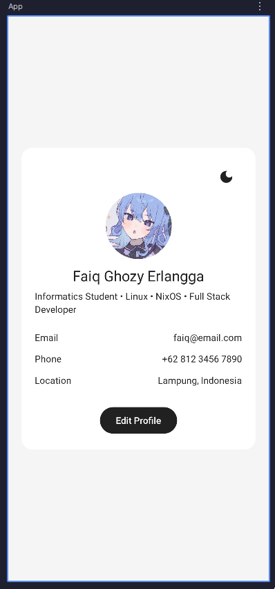
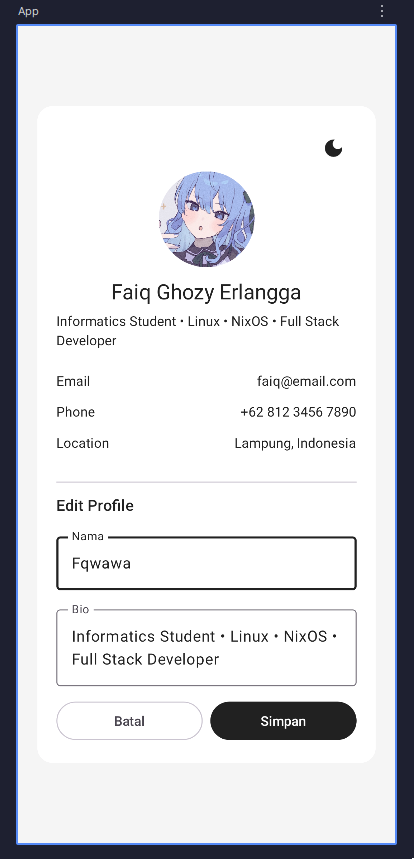
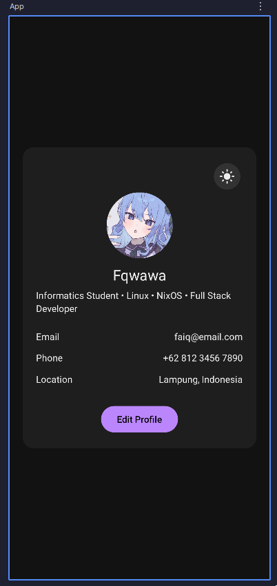

# Aplikasi Profile dengan Dark Mode

## Screenshot Aplikasi

## Cara run aplikasi
- Buka Android Studio
- Buka file `/Pertemuan-4/composeApp/src/androidMain/kotlin/com/pertemuan3/App.kt`
- Tekan tombol hijau Run di kanan atas
- Buka aplikasi pertemuan-4
