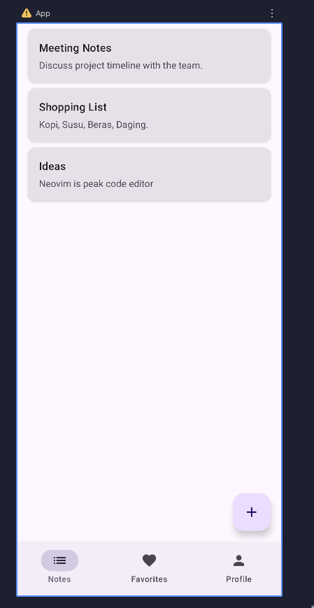
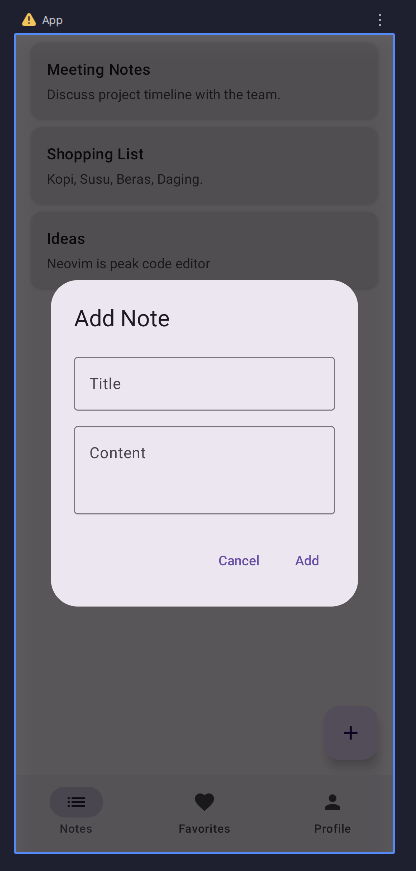
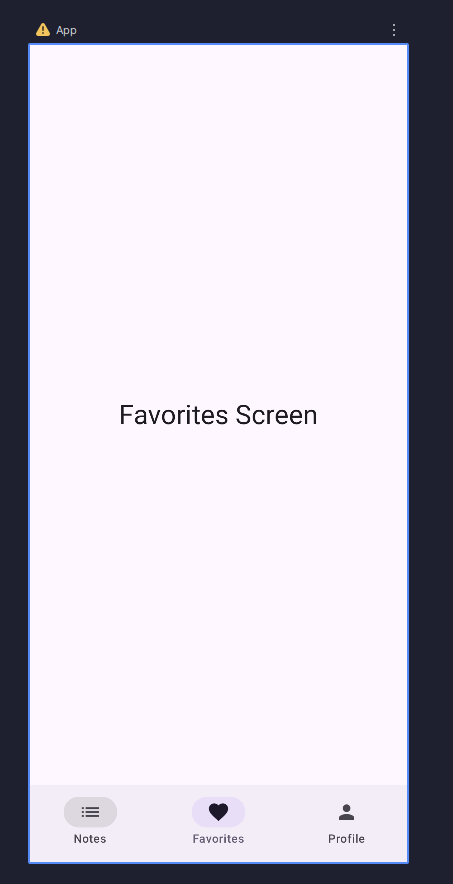
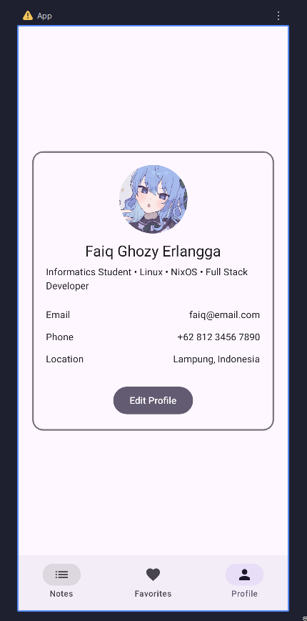
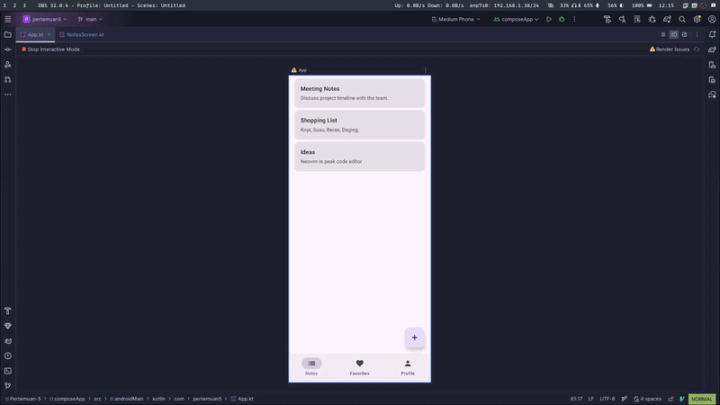

# Aplikasi Notes Sederhana

## Screenshot Aplikasi

## Demo

## Cara run aplikasi
- Buka Android Studio
- Buka file `/Pertemuan-5/composeApp/src/androidMain/kotlin/com/pertemuan5/App.kt`
- Tekan tombol hijau Run di kanan atas
- Buka aplikasi pertemuan-5
