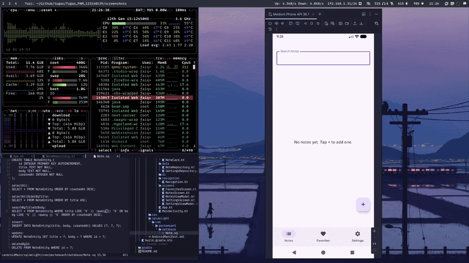
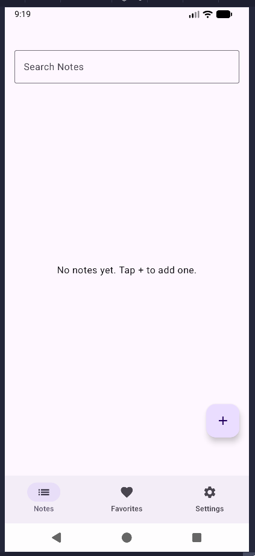
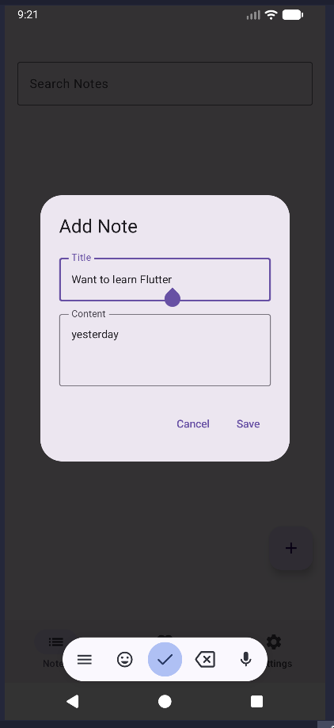
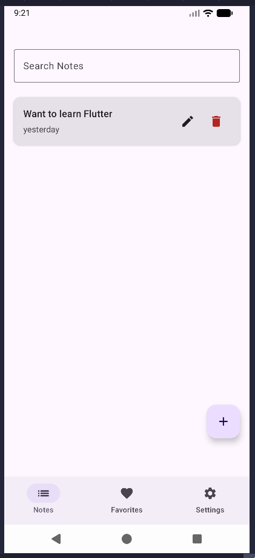
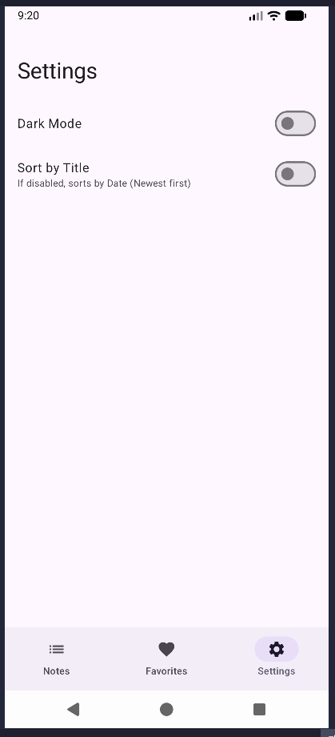
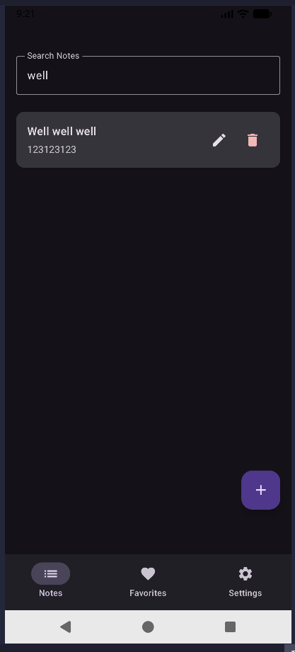
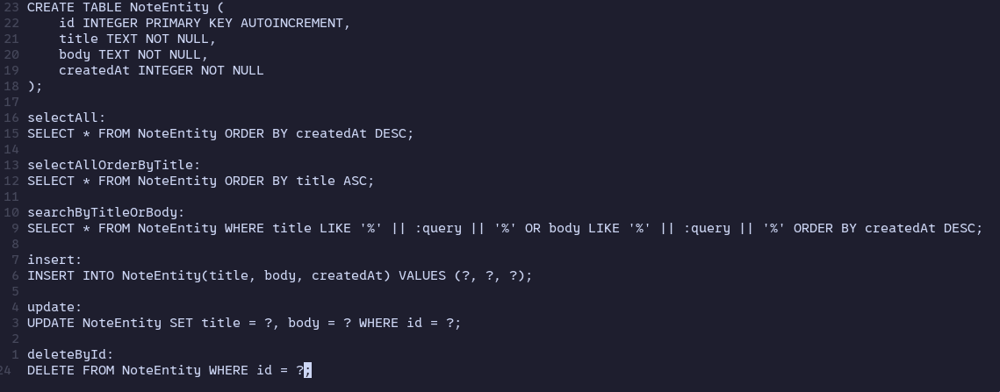

# Aplikasi Notes Sederhana - Pertemuan 7

## Demo

## Screenshot Aplikasi

## Cara run aplikasi
- Buka Android Studio
- Buka folder `Pertemuan-7`
- Tekan tombol **Run** (Ikon palu atau play hijau)
