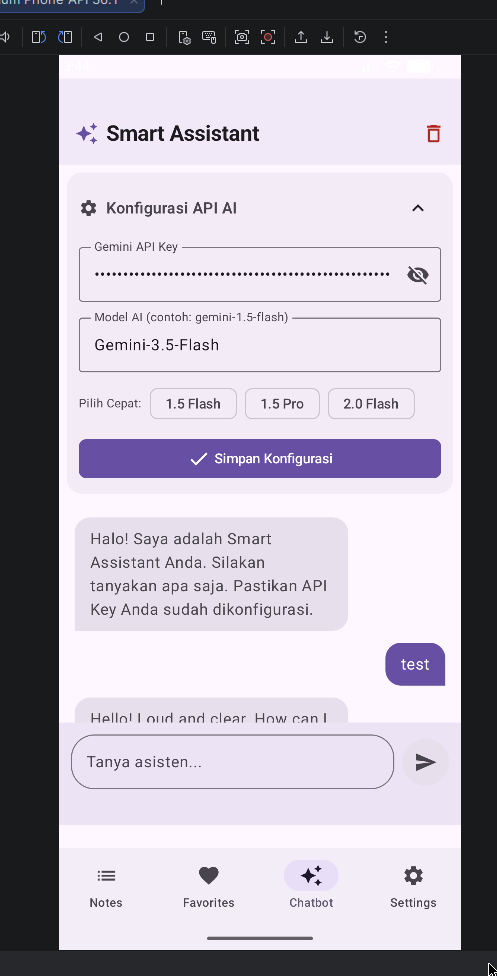
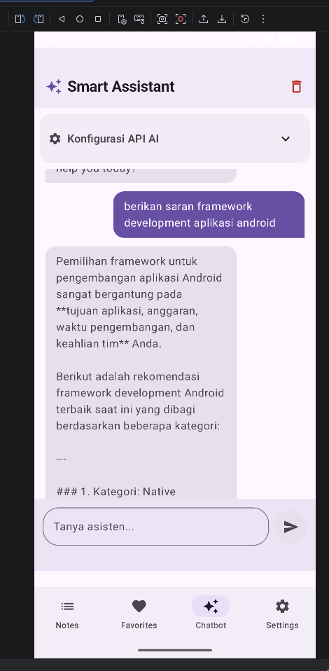

# Aplikasi Notes dengan Platform Integration dan AI Chatbot - Pertemuan 9

## Screenshot Aplikasi

## Fitur Smart Chatbot
Asisten virtual interaktif terintegrasi dengan Google Gemini API:
- **Tab Navigasi Khusus**: Tab "Chatbot" pada bar navigasi bawah.
- **Konfigurasi API Key**: Input Kunci API yang tersimpan aman pada DataStore.
- **Kustomisasi & Normalisasi Model**: Mendukung input model manual (misal `gemini-3.5-flash`) dengan pembersihan otomatis spasi dan huruf kapital.
- **Interface Chat Interaktif**: Bubble chat adaptif, auto-scroll, indikator pengetikan (loading), dan opsi hapus riwayat chat.

## Cara run aplikasi
- Buka Android Studio
- Buka folder `Pertemuan-9`
- Tekan tombol **Run** (Ikon palu atau play hijau)
