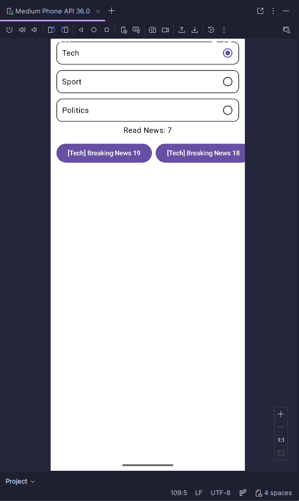

# Aplikasi News Feed Simulator Sederhana
Aplikasi ini dibuat untuk saya mempelajari Project Structure dari Compose Multiplatform dan mempelajari statefull ui di Jetpack Compose

## Screenshot Aplikasi


### Cara run aplikasi
- Buka Android Studio
- Buka file "/pertemuan-2/composeApp/src/commonMain/kotlin/pam/tugas/App.kt"
- Tekan tombol hijau Run di kanan atas
- BUka aplikasi pertemuan-2

## Dokumentasi
#### /composeApp/src/commonMain/kotlin/pam/tugas/App.kt
1. Disini saya mempelajari bahwa cara kerja Compose Multiplatform mirip seperti React dengan manipulasi state untuk membuat ui yang interaktif
```kotlin
    val repository = remember { NewsRepository() }
    val viewModel = remember { NewsViewModel(repository) }

    val news by viewModel.newsFeed.collectAsState()
    val readCount by viewModel.readCount.collectAsState()
    val selectedCategory by viewModel.selectedCategoryState.collectAsState()
```

2. Di compose, cara mendeklarasikan ui adalah dengan menggunakan library compose.ui dengan unit-unit ui seperti Column, Row, Button dll diikuti dengan menambahkan macro @Composable diatas fungsi. Ui juga bisa dibuat sebagai fungsi agar bisa digunakan berkali kali
```kotlin
@Composable
fun CategoryItem(
    text: String,
    selected: Boolean,
    onClick: () -> Unit
) {
    Row(
        modifier = Modifier
            .padding(horizontal = 12.dp, vertical = 6.dp)
            .fillMaxWidth()
            .clip(RoundedCornerShape(12.dp))
            .background(Color.White)
            .border(1.dp, Color.Black, RoundedCornerShape(12.dp))
            .clickable { onClick() }
            .padding(12.dp),
        horizontalArrangement = Arrangement.SpaceBetween,
        verticalAlignment = Alignment.CenterVertically
    ) {
        Text(text)
        RadioButton(selected = selected, onClick = null)
    }
}
```

3. Di compose, penggunaan asynchronous dan stateflow bisa dideklarasikan didalam sebuah class seperti ini, class ini bisa dipanggil didalam fungsi composable agar statenya bisa digunakan untuk ui yang interaktif
```kotlin
class NewsViewModel(
    private val repository: NewsRepository
) {
    private val scope = CoroutineScope(SupervisorJob() + Dispatchers.Default)

    private val selectedCategory = MutableStateFlow("Tech")
    val selectedCategoryState: StateFlow<String> = selectedCategory
```
